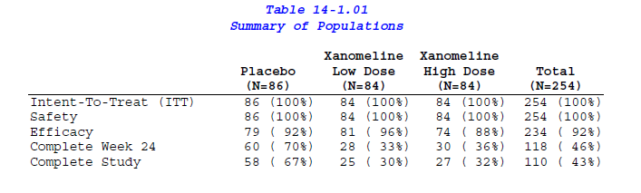

# tlf-extractor

Extract individual TFLs (Tables, Listings, Figures) from a Clinical Study Report PDF.

## What it does



Given a CSR PDF following the ICH E3 structure, this tool:
- Detects and extracts each Table, Listing, and Figure from Section 14
- Extracts the narrative body (Sections 1-13) as a separate document
- Outputs individual PDFs + raw text files
- Generates a manifest (JSON + CSV) mapping every TFL to its source page range, title, population, and SAS program

## Why this exists

Clinical Study Reports embed dozens of TFLs inside a single multi-hundred-page PDF. 
Medical Writers, Clinical Data Scientists, and QC reviewers often need to work with individual tables — 
for QC, cross-referencing, automation, or building tools that verify TFL-text coherence. 
To do this efficiently, you first need to split them out.

This tool automates that extraction for any CSR following the ICH E3 / eCTD standard.

## Quick start

```bash
# Clone the repository
git clone https://github.com/yourusername/tlf-extractor.git
cd tlf-extractor

# Install dependencies (requires Python 3.10+)
pip install -r requirements.txt

# Run extraction on a CSR PDF
python extract_tlfs.py --input input/cdiscpilot01.pdf --output output/
```

## Usage

```bash
usage: extract_tlfs.py [-h] [--input INPUT] --output OUTPUT [--verbose] [--dry-run] [--validate] [--no-text]

Extract TFLs from Generic ICH E3 CSR PDF.

options:
  -h, --help       show this help message and exit
  --input INPUT    Path to the input PDF file
  --output OUTPUT  Directory to save the extracted outputs
  --verbose        Print verbose extraction steps
  --dry-run        Detect without creating files
  --validate       Run validation on output directory
  --no-text        Skip text extraction
```

## Example output

```json
{
  "source_file": "cdiscpilot01.pdf",
  "source_pages": 492,
  "extraction_date": "2025-02-27T14:30:00Z",
  "narrative": {
    "file": "pdf/narrative_body.pdf",
    "pages_in_source": [1, 42],
    "page_count": 42
  },
  "tlfs": [
    {
      "id": "Table 14-1.01",
      "type": "table",
      "title": "Summary of Populations",
      "file": "pdf/Table_14-1.01.pdf",
      "pages_in_source": [43, 43],
      "page_count": 1,
      "population": "All Subjects",
      "source_program": "C:\\cdisc_pilot\\PROGRAMS\\DRAFT\\TFLs\\adsl1.sas"
    }
  ]
}
```

## Example: CDISC Pilot CSR

This tool was developed and tested using the CDISC Pilot Project CSR 
(CDISCPILOT01), a publicly available example CSR:
- [CSR PDF on GitHub](https://github.com/cdisc-org/sdtm-adam-pilot-project/blob/master/updated-pilot-submission-package/900172/m5/53-clin-stud-rep/535-rep-effic-safety-stud/5351-stud-rep-contr/cdiscpilot01/cdiscpilot01.pdf)
- [CDISC Pilot Project Repository](https://github.com/cdisc-org/sdtm-adam-pilot-project)
- [R for Clinical Study Reports (r4csr)](https://r4csr.org/)

This CSR contains 30 tables + 1 figure in Section 14 (109 pages), 
plus a 42-page narrative body.

## Limitations

- Designed for CSRs following the ICH E3 structure with Section 14 TFLs
- TFL detection relies on "Table X-Y.ZZ" / "Figure X-Y" patterns and "Page X of Y" pagination
- CSRs with non-standard formatting may require adjustments to the detection regex
- Appendix listings (Section 16) are not extracted in the current version

## License

MIT
